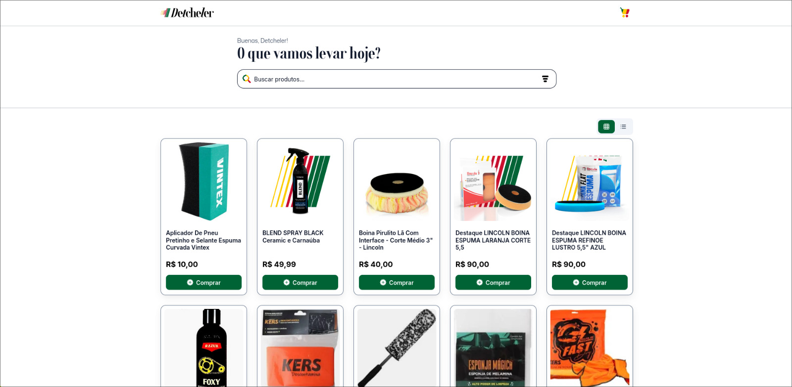

<div align="center">

# 🛍️ Tiny Products Catalog

**Catálogo moderno de produtos com sincronização automática do Tiny ERP**

[](https://github.com/DionathaGoulart)
[](LICENSE)
[](https://reactjs.org/)
[](https://www.typescriptlang.org/)
[](https://nodejs.org/)
[](https://www.mongodb.com/)

</div>

---

## 📸 Preview

<div align="center">


<p><em>Visualização desktop do catálogo com produtos e filtros</em></p>


<p><em>Visualização mobile responsiva do catálogo de produtos</em></p>

</div>

---

## ✨ Funcionalidades

### 🎯 Principais Características

- **🛍️ Catálogo Completo** - Visualização de produtos com paginação e filtros avançados
- **🔍 Busca Inteligente** - Sistema de busca com debounce e histórico de pesquisas
- **🛒 Carrinho de Compras** - Adição, remoção e gerenciamento de produtos no carrinho
- **💬 Integração WhatsApp** - Envio automático de pedidos via WhatsApp Business
- **📱 Design Responsivo** - Interface otimizada para desktop, tablet e mobile
- **🎬 Vídeo Introdutório** - Apresentação animada com skip automático
- **🔄 Sincronização Automática** - Sync em tempo real com Tiny ERP via API
- **⚡ Performance Otimizada** - Lazy loading, code splitting e cache inteligente

### 🛠️ Funcionalidades Técnicas

- **🏗️ Arquitetura Full-Stack** - Frontend React + Backend Node.js separados
- **📊 Gerenciamento de Estado** - Zustand para UI e carrinho com persistência
- **🔄 Cache Inteligente** - React Query para cache de API e sincronização
- **📝 TypeScript Completo** - Tipagem forte em frontend e backend
- **🛡️ Rate Limiting** - Proteção contra spam na API do Tiny ERP
- **📋 Logs Estruturados** - Sistema completo de logging com níveis

---

## 🏗️ Arquitetura do Projeto

```
Catalog/
├── 📁 frontend/              # Frontend React + TypeScript
│   ├── src/
│   │   ├── app/              # Componentes principais
│   │   ├── core/             # Stores, hooks, utils
│   │   ├── features/         # Funcionalidades específicas
│   │   ├── shared/           # Componentes reutilizáveis
│   │   └── types/            # Definições TypeScript
│   ├── dist/                 # Build de produção
│   └── package.json          # Dependências frontend
├── 📁 backend/               # Backend Node.js + Express
│   ├── src/
│   │   ├── config/           # Configurações
│   │   ├── middlewares/      # Middlewares Express
│   │   ├── models/           # Modelos MongoDB
│   │   ├── routes/           # Rotas da API
│   │   ├── services/         # Serviços de negócio
│   │   └── utils/            # Utilitários
│   ├── server.js             # Servidor principal
│   └── package.json          # Dependências backend
├── 📁 netlify.toml           # Configuração deploy
└── 📁 LICENSE                # Licença proprietária
```

---

## 📄 Páginas e Seções

### 🏠 Página Principal (Catálogo)

- **Grid/Lista de Produtos** - Visualização alternável entre grid e lista
- **Filtros Avançados** - Por categoria, preço, status e ordenação
- **Paginação Inteligente** - Navegação otimizada para mobile e desktop
- **Busca em Tempo Real** - Com sugestões e histórico
- **Auto-reload** - Recarregamento automático quando API está inativa

### 🛒 Página do Carrinho

- **Gerenciamento de Itens** - Adicionar, remover e alterar quantidades
- **Informações do Cliente** - Nome, telefone, endereço e observações
- **Integração WhatsApp** - Envio automático do pedido formatado
- **Cálculo de Totais** - Soma automática de produtos e quantidades

### 🔍 Página de Busca

- **Resultados Inteligentes** - Busca com debounce e cache
- **Histórico de Pesquisas** - Últimas 10 buscas realizadas
- **Filtros de Resultados** - Aplicação de filtros na busca
- **Navegação por Produtos** - Acesso direto aos detalhes

### 📱 Modal de Produto

- **Detalhes Completos** - Informações, imagens e especificações
- **Adição ao Carrinho** - Controle de quantidade e adição rápida
- **Navegação por Imagens** - Galeria de fotos do produto
- **Integração WhatsApp** - Compra direta via WhatsApp

---

## 🛠️ Tecnologias Utilizadas

### Frontend

- **React 18.2.0** - Biblioteca principal para interface
- **TypeScript 5.9.3** - Tipagem estática e desenvolvimento seguro
- **Vite 4.4.5** - Build tool moderno e rápido
- **Tailwind CSS 3.3.3** - Framework CSS utilitário
- **React Router DOM 6.15.0** - Roteamento client-side
- **Zustand 4.4.1** - Gerenciamento de estado leve
- **React Query 5.80.0** - Cache e sincronização de dados
- **Framer Motion 10.16.4** - Animações e transições
- **Lucide React 0.279.0** - Ícones modernos e otimizados
- **React Hot Toast 2.4.1** - Notificações elegantes
- **Axios 1.5.0** - Cliente HTTP para APIs

### Backend

- **Node.js 18+** - Runtime JavaScript server-side
- **Express 4.18.2** - Framework web minimalista
- **MongoDB 7.5.0** - Banco de dados NoSQL
- **Mongoose 7.5.0** - ODM para MongoDB
- **Node-cron 3.0.2** - Agendamento de tarefas
- **CORS 2.8.5** - Controle de acesso cross-origin
- **Axios 1.5.0** - Cliente HTTP para APIs externas

### Ferramentas de Desenvolvimento

- **ESLint 8.50.0** - Linter para qualidade de código
- **TypeScript Compiler** - Compilação e verificação de tipos
- **PostCSS 8.4.29** - Processamento de CSS
- **Autoprefixer 10.4.15** - Prefixos CSS automáticos
- **Nodemon 3.0.1** - Hot reload para desenvolvimento

### Deploy e CI/CD

- **Netlify** - Deploy automático do frontend
- **GitHub Actions** - CI/CD e workflows automatizados
- **MongoDB Atlas** - Banco de dados em nuvem
- **Netlify Functions** - Serverless functions (se necessário)

### Integrações

- **Tiny ERP API** - Sincronização de produtos
- **WhatsApp Business API** - Envio de pedidos
- **MongoDB Atlas** - Banco de dados em nuvem

---

## 🚀 Como Executar

### Pré-requisitos

- Node.js 18+ instalado
- MongoDB (local ou Atlas)
- Token da API do Tiny ERP
- Conta Netlify (para deploy)

### Instalação

```bash
# Clone o repositório
git clone https://github.com/DionathaGoulart/tiny-products-catalog.git

# Entre no diretório
cd tiny-products-catalog

# Instale as dependências do frontend
cd frontend && npm install

# Instale as dependências do backend
cd ../backend && npm install
```

### Scripts Disponíveis

```bash
# Frontend - Desenvolvimento
npm run dev          # Servidor de desenvolvimento (porta 5174)
npm run build        # Build de produção
npm run preview      # Preview do build

# Backend - Desenvolvimento
npm run dev          # Servidor com nodemon (porta 3000)
npm start            # Servidor de produção
npm run lint         # Verificação de código
npm run lint:fix     # Correção automática de lint

# Backend - Debug
npm run debug        # Execução com logs detalhados
```


## 🔧 Configuração

### Variáveis de Ambiente

Crie um arquivo `.env.local` na raiz do projeto:

```env
# Backend
MONGODB_URI=mongodb://localhost:27017/tiny-catalog
TINY_TOKEN=seu_token_da_api_tiny
TINY_RATE_LIMIT_REQUESTS=25
TINY_RATE_LIMIT_WINDOW=60000

# Frontend
VITE_API_URL=http://localhost:3000/api
VITE_WHATSAPP_NUMBER=5511999999999
```

### Personalização

- **Cores**: Edite `frontend/src/shared/styles/globals.css`
- **Configurações**: Configure em `frontend/src/core/constants/api.js`
- **Ícones**: Modifique os arquivos em `frontend/src/assets/`
- **Imagens**: Adicione seus arquivos em `frontend/src/assets/`
- **Configuração**: Configure em `frontend/tailwind.config.cjs`

---

## 📄 Licença

**⚠️ ATENÇÃO: Este projeto é de uso exclusivo e pessoal.**

### Direitos Reservados

Este software e sua documentação são propriedade exclusiva do autor e estão protegidos por direitos autorais. É **expressamente proibido**:

- ❌ **Copiar** o código fonte
- ❌ **Modificar** sem autorização
- ❌ **Distribuir** o software
- ❌ **Usar** para fins comerciais
- ❌ **Criar trabalhos derivados**
- ❌ **Fazer engenharia reversa**

### Uso Permitido

- ✅ **Visualizar** o código para fins educacionais
- ✅ **Estudar** a implementação para aprendizado
- ✅ **Inspirar-se** nas ideias e conceitos
- ✅ **Fazer fork** apenas para estudo pessoal

### Consequências

A violação desta licença resultará em:

- Ação legal imediata
- Remoção do conteúdo infrator
- Danos e prejuízos conforme a lei

**© 2025 Dionatha Goulart. Todos os direitos reservados.**

---

## 📞 Contato

**Desenvolvedor**: Dionatha Goulart  
**Email**: dionatha.work@gmail.com  
**Portfolio**: https://dionatha.com.br/  
**GitHub**: https://github.com/DionathaGoulart  
**Linkedin**: https://www.linkedin.com/in/dionathagoulart/

---

<div align="center">

**Feito by Dionatha Goulart**

</div>
