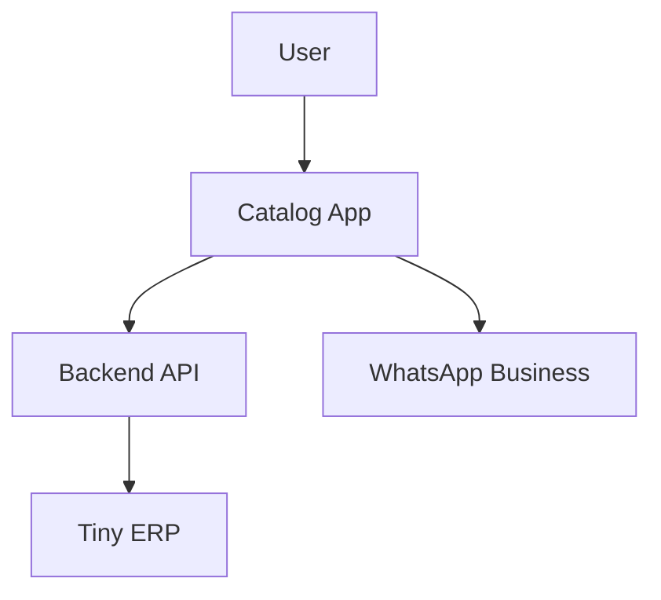

<div align="center">

# DETCHELER CATALOG
### DIGITAL CATALOG


<br />

**Catálogo moderno de produtos com sincronização automática do Tiny ERP.**
**Integração com WhatsApp para envio de pedidos.**

[Getting Started](#-getting-started) • [License](#-license)

</div>

---

## 🏗️ Architecture

Fullstack application integrating with **Tiny ERP** for product data and **WhatsApp** for orders.


```mermaid
graph TD;
    User-->App[Catalog App];
    App-->API[Backend API];
    API-->TinyERP[Tiny ERP];
    App-->WhatsApp[WhatsApp Business];
```

---

## 🚀 Features

<div align="center">

| Feature | Description |
|:-------:|:----------- |
| **ERP Sync** | Automatic synchronization with Tiny ERP. |
| **Shopping Cart** | Persistent cart with Zustand. |
| **WhatsApp Order** | Direct order submission via WhatsApp. |

</div>

---

## 🛠️ Getting Started

### Prerequisites

*   **Node.js 18+**
*   **MongoDB**

### Installation

```bash
# Private Repository
# Contact owner for access
```

---

## 📄 License

This project is proprietary and confidential.

**Copyright © 2026 Dionatha Goulart.**
All Rights Reserved.
